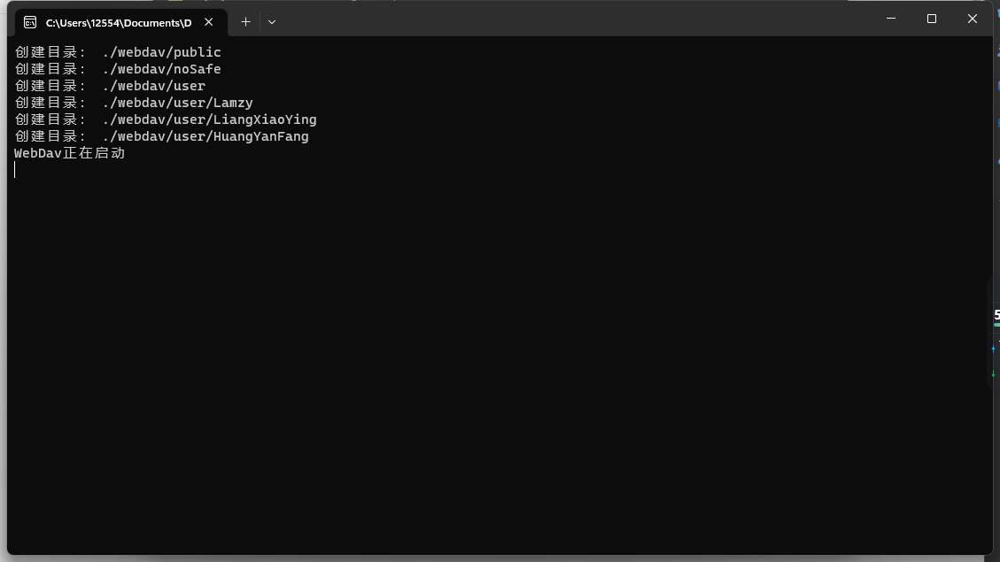
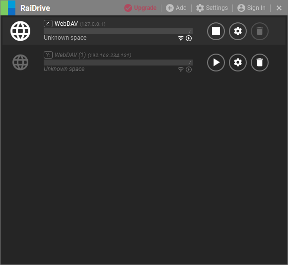
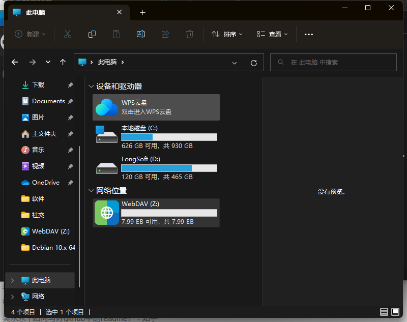
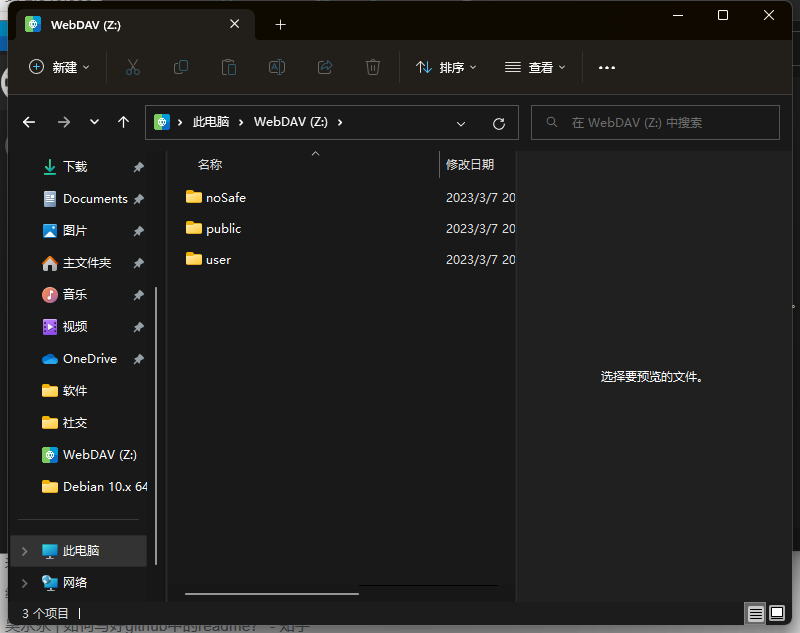

# Go轻量化可挂载webdav，有用户组权限管理

# 使用场景
#### nas系统(OpenMediaVault)，因为没有带Webdav功能，同时不想搭建Docker，所以我就自己写一个，同时包含用户组权限管理（权限管理直接焊接在代码里面了）
#### 用户组有两个一个是 admin 和 family
#### 配置文件见 config.json

# 权限说明
#### noSafe 任何用户可读可写
#### public admin 读写 | family 读
#### user/自己用户 admin 读写 | family 读写
#### user/非己用户 admin 读写 | family 读

# 使用流程
### 默认启用端口8080
### 配置config（可也以不用配用默认）
## Windows
#### 双击output下OmvWebdav.exe 即可运行
## Linux
#### cd到output目录下 输入命令：
#### # chmod 777 OmvWebdav_linux
#### # nohup ./OmvWebdav_linux
